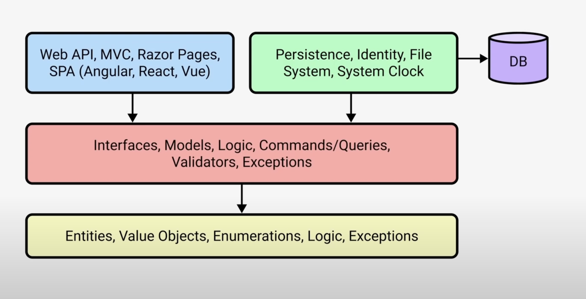

# vancouver-stock-exchange

Creating a Stock Exchange Simulation using .NET. Complete with buy sell orders and an orderbook.

## Design Decisions

### Organization

Used Clean Architecture to separate project into layers. Those layers are Infrastructure layer (responsible for external tools), API layer (responsible for handling http requests), Application layer (responsible for business logic), Domain layer (responsible for defining domain entities). All dependencies flow inwards which helps makes outer layers more modular and easier to adapt.

### Algorithm/Data Structure for Orderbook

Considering using sorted set and linkedlist to create orderbook.

## Tech Stack

- **.NET**
  - Created api that can receive buy and sell orders
  - Entity Framwork to query the SQL database

## How to run

1. Navigate to Exchange.API folder

2. Run `dotnet run`

### Exhanges specific rules

In a limit order book exchange, the trading price is determined by the intersection of the highest buy order (also known as the "bid") and the lowest sell order (also known as the "ask").

If the highest buy order price is greater than or equal to the lowest sell order price, a trade can occur. In this case, the trading price will be the price of the lowest sell order, which is the "ask" price. This is because the buyer is willing to pay the price at which the seller is willing to sell, so the trade occurs at the seller's price.
Conversely, if the lowest sell order price is greater than or equal to the highest buy order price, a trade can occur at the price of the highest buy order, which is the "bid" price. This means the seller is willing to accept the price at which the buyer is willing to buy.
In summary, the trading price in a limit order book exchange is determined by the price of the order that can be immediately matched with an opposing order, and this is usually the price of the lowest sell order when a buy order is placed or the price of the highest buy order when a sell order is placed. It's not typically an average of the two order prices.
